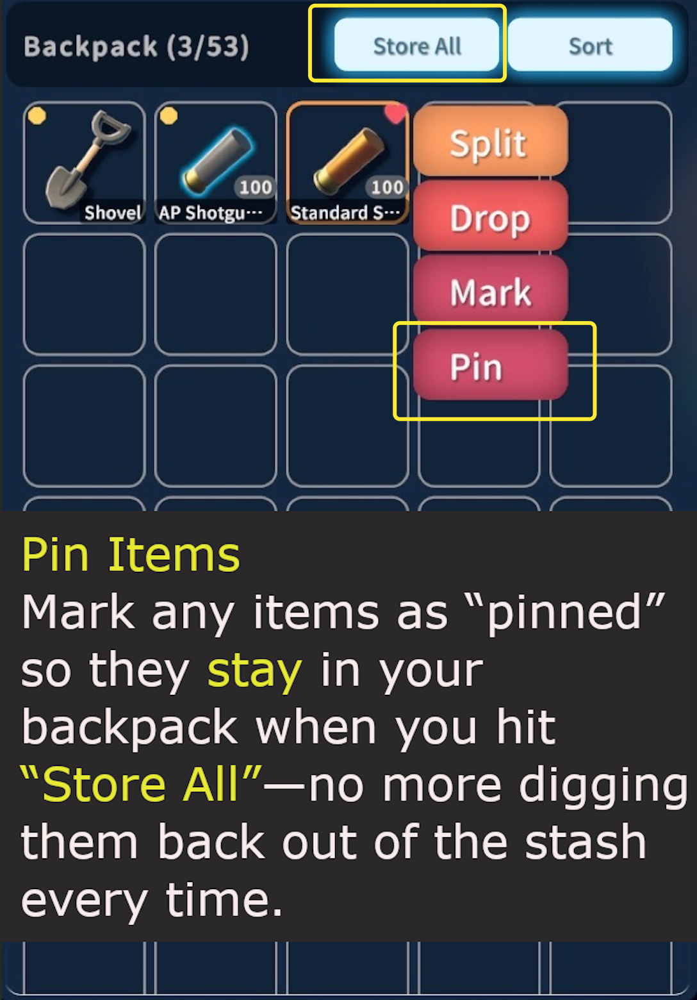

# Pin Items Mod

[中文说明 / Chinese README](README_zh-CN.md)

A small quality-of-life mod that lets you **pin** items in your backpack so they are not auto-stashed when you use **Store All**.

## Features

- Mark any item as **pinned** so it stays in your backpack when you press `Store All`.
- Avoid re-grabbing your favorite gear from the stash after every loot run.
- Pinned items can still be moved to the stash one by one if you want to.

## Usage

- Open your backpack.
- Select an item you want to keep on you.
- Use the `Pin` option from the item menu.
- When you hit `Store All`, pinned items remain in your backpack while everything else is stored.
- If you manually move a pinned item into the stash, it is **unpinned** automatically.

Enjoy smoother inventory management with less stash juggling.
